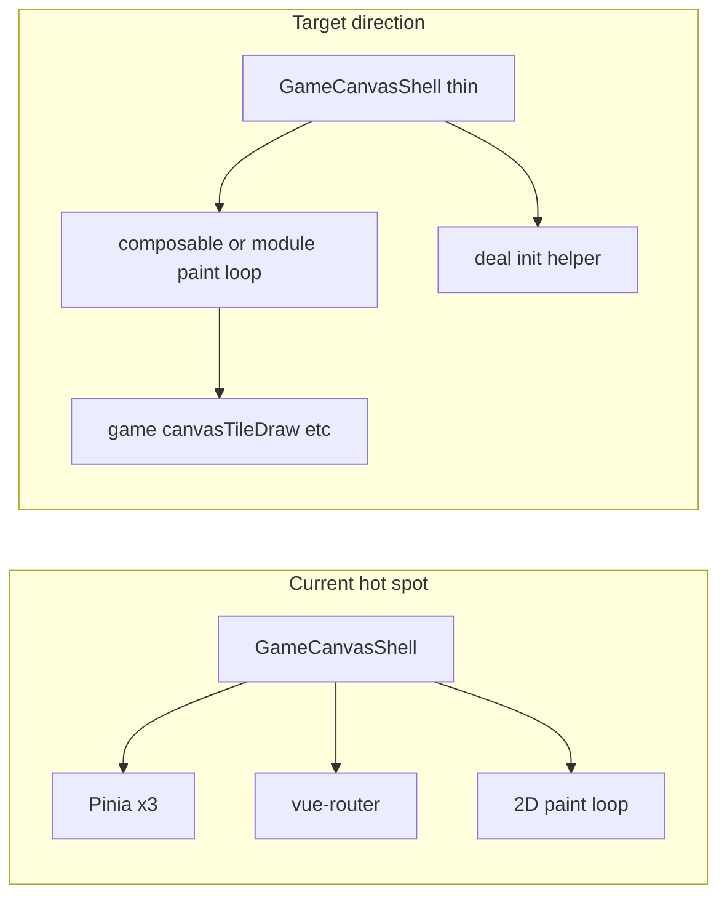

# Components, composables, and utils audit

## Scope and method

Reviewed Vue SFCs under `[src/components](src/components)` and `[src/views](src/views)` (views orchestrate components), all `[src/composables/*.ts](src/composables)` excluding `*.spec.ts`, plus supporting pure modules in `[src/game](src/game)` and `[src/pwa](src/pwa)` that those layers import. **Tests were not analyzed**, per your instruction.

Overall the split is reasonable: **game rules and canvas drawing** live under `game/`, **orchestration** in views/composables, **presentation** in components. The main structural debt is concentration of behavior in one component and a few copy-paste seams.

---

## High-impact findings

### 1. `GameCanvasShell.vue` — god component and tight coupling

`[src/components/GameCanvasShell.vue](src/components/GameCanvasShell.vue)` (~1000 lines) directly owns:

- Three Pinia stores (`gamePlay`, `gameSession`, `gameSettings`) and `vue-router` (`replace` to strip navigation state).
- Full canvas lifecycle: sizing, DPR, image cache, `ResizeObserver`, rAF paint loop.
- Animation state (parallel arrays: `reveal01`, `matchFade01`, parallax, highlights), mismatch timing, collect flight queue.
- Session bootstrap (`initRoundIfNeeded`), deal RNG from settings, snapshot restore.

**Validation:** For a canvas game this *can* be one file, but **maintainability and testability** suffer: any change to routing, persistence, or paint risks unrelated regressions.

**Complicated patterns (not “wrong”, but dense):**

- Several **sequential O(n) passes** over cells per frame (parallax targets → smooth → highlights → draw). That is normal for canvas; there is **no O(n²) nested loop** over the board.
- `**initRoundIfNeeded` duplicates** the same “begin session + `resolveRngAndDealKindForNewShuffle` + `takeDealRng` + `startNewRound`” block for two branches (`[GameCanvasShell.vue](src/components/GameCanvasShell.vue)` ~lines 872–908). Clear redundancy.

**Naming:**

- `subsetEntry` is easy to misread; it resolves the `TileEntry` for an identity index constrained by the current pair count — a name like `entryForIdentityInDeal` (or similar) would match behavior.
- `hk` as the highlight smoothing factor is terse; `highlightSmoothK` or reusing an existing `lerpToward`-style helper would read clearer.

**Reduced motion inconsistency:** `onMounted` reads `matchMedia` once and **never subscribes** to changes, unlike `[useAmbientChaseLight](src/composables/useAmbientChaseLight.ts)` and `[WinDebriefPanel.vue](src/components/WinDebriefPanel.vue)`. Users toggling OS “reduce motion” at runtime see inconsistent behavior across screens.

---

### 2. Composables: placement and duplication

| Item                                                                                                                                                | Assessment                                                                                                                                                                                                                                                                                                                                                                                                                                                         |
| --------------------------------------------------------------------------------------------------------------------------------------------------- | ------------------------------------------------------------------------------------------------------------------------------------------------------------------------------------------------------------------------------------------------------------------------------------------------------------------------------------------------------------------------------------------------------------------------------------------------------------------ |
| `[useBriefcaseNavigateToGame.ts](src/composables/useBriefcaseNavigateToGame.ts)`                                                                    | **Good:** router + three stores coordinated in one place; confirm callback injected — low UI coupling.                                                                                                                                                                                                                                                                                                                                                             |
| `[useAmbientChaseLight.ts](src/composables/useAmbientChaseLight.ts)`                                                                                | **Good:** self-contained rAF + pointer logic; uses `[ambientPointerMath.ts](src/game/ambientPointerMath.ts)`. Size is justified by FR-001 behavior.                                                                                                                                                                                                                                                                                                                |
| `[useActivePlayTime.ts](src/composables/useActivePlayTime.ts)`                                                                                      | **Good:** small, single responsibility.                                                                                                                                                                                                                                                                                                                                                                                                                            |
| `[usePwaInstallPrompt.ts](src/composables/usePwaInstallPrompt.ts)` + `[usePwaInstallFallbackHint.ts](src/composables/usePwaInstallFallbackHint.ts)` | **Redundancy:** repeated checks for standalone PWA, `blocksPwaInstallSheet`, `sessionStorage` sheet-offered flag, and `peekDeferredInstallPrompt`. A shared `shouldSuppressPwaUi()` (or similar) in `[pwaInstallUiStorage.ts](src/game/pwaInstallUiStorage.ts)` / small `pwa/` helper would reduce drift risk.                                                                                                                                                     |
| `[useNineDigitSeedMask.ts](src/composables/useNineDigitSeedMask.ts)`                                                                                | **Misleading:** exports only `formatMaskedNineDigitsFromRawInput` — **no Vue composition API**. This is a **pure string helper**; living under `composables/` confuses discoverability. `[BriefcaseView.vue](src/components/briefcase/BriefcaseView.vue)` imports it correctly functionally, but the path suggests a hook. Better: `src/game/seedMaskFormat.ts` (next to `[seedDeal.ts](src/game/seedDeal.ts)`) or a tiny `src/utils/` if you add more formatters. |

---

### 3. Cross-layer duplication (utils / types)

- `**isDifficulty` type guard** appears in both `[GameView.vue](src/views/GameView.vue)` and `[playerSettingsStorage.ts](src/game/playerSettingsStorage.ts)`. Single export (e.g. `src/game/tileLibraryTypes.ts` or `src/game/isDifficulty.ts`) would avoid divergence.
- **Clamp / lerp:** `[animationEasing.ts](src/game/animationEasing.ts)` has `clamp01`; `[ambientPointerMath.ts](src/game/ambientPointerMath.ts)` `lerp2d` inlines `Math.min(1, Math.max(0, t))`. Minor duplication only; unify only if you want one numeric style guide.
- **Viewport normalization:** `[MemoAmbientSpotlight.vue](src/components/ambient/MemoAmbientSpotlight.vue)` recomputes width/height and 0–100% mapping; `[useAmbientChaseLight](src/composables/useAmbientChaseLight.ts)` already has `viewportSize()`. Not wrong, but duplicated concepts.

---

### 4. Components — coupling and reuse

- **Presentation components** (`[SessionHistoryLedger.vue](src/components/SessionHistoryLedger.vue)`, `[AppButton.vue](src/components/ui/AppButton.vue)`, `[MemoConfirmDialog.vue](src/components/ui/MemoConfirmDialog.vue)`) are **appropriately scoped** to Pinia or props/emits.
- `[WinDebriefPanel.vue](src/components/WinDebriefPanel.vue)` `**computed` summary** falls back to `filterWonSessionsNewestFirst(session.readCompletedList())` when the live session is not `won` — slightly subtle (depends on store timing). `[SessionHistoryLedger](src/components/SessionHistoryLedger.vue)` uses the same filter for the table; behavior is consistent but the **“summary source of truth”** is implicit. Optional improvement: one small selector/helper `latestWonSummary(session)` in `[winDebriefHistory.ts](src/game/winDebriefHistory.ts)` used by both.
- `[BriefcaseView.vue](src/components/briefcase/BriefcaseView.vue)` **promise-based confirm** (`requestMismatchConfirm`) is a valid pattern for bridging `MemoConfirmDialog` with async navigation; slightly heavy but localized.

---

### 5. Nested loops and complexity

- **No problematic nested loops** found in composables or typical UI components.
- **Game canvas** loops are **linear scans** per frame; acceptable for board sizes used.

---

### 6. Style consistency (minor)

- `[HomeView.vue](src/views/HomeView.vue)` uses **double quotes** and semicolons in `<script>`; most of the repo uses **single quotes** and no semicolons. Purely cosmetic; align with ESLint/Prettier if you care.

---

## Suggested refactor order (if you implement later)

1. **Extract** duplicated `initRoundIfNeeded` deal path in `GameCanvasShell` into a local function (or `game/` helper that takes stores + layout + history state) — **low risk, high clarity**.
2. **Extract** shared PWA gating predicate used by `usePwaInstallPrompt` and `usePwaInstallFallbackHint`.
3. **Move** `formatMaskedNineDigitsFromRawInput` out of `composables/` into `game/` (and update imports).
4. **Unify** `isDifficulty` in one module; re-export from `GameView` / storage as needed.
5. **Optional larger slice:** split `GameCanvasShell` into `useGameCanvasPaint` (rAF + buffers) + `useGameCanvasAssets` (image cache) + thin SFC — **higher effort**, best after tests lock behavior (you asked to skip tests in this review, but they matter for this step).

---

## What looks solid (no change needed for “architecture”)

- `[useBriefcaseNavigateToGame](src/composables/useBriefcaseNavigateToGame.ts)` as the single place for Briefcase → game policy.
- `[playerSettingsStorage.ts](src/game/playerSettingsStorage.ts)` / `[pwaInstallUiStorage.ts](src/game/pwaInstallUiStorage.ts)` — structured parse/validate with schema version.
- `[SessionHistoryLedger.vue](src/components/SessionHistoryLedger.vue)` — focused, readable.

